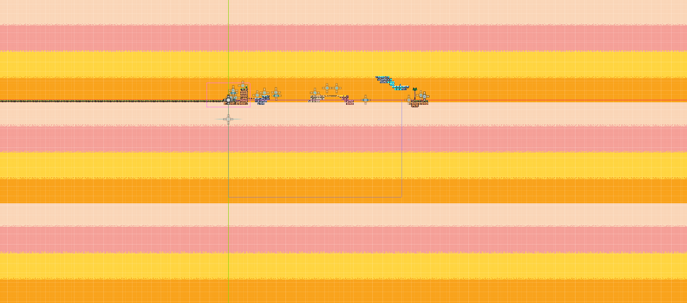

# First Ever Game

## First Session

All [Assets](https://brackeysgames.itch.io/brackeys-platformer-bundle) can be found here.

### Concepts

1. What is a Node?
2. What is a Custom Node?
3. What is a Scene?
4. What is Nesting? (Scene inside another Scene)
5. Why use Scene for different items?
6. What is scene root in a Scene?
7. What is an instance?
8. What are _ready and _process functions?
9. What is the difference between TileMap and TileSet?

### Implementations

1. How to install Godot
2. How to create a new project
3. Play around in the environment and see where things are
4. How to setup [assets](https://brackeysgames.itch.io/brackeys-platformer-bundle)
5. First ever Character
6. TileMap and level Design (Play with the options)
7. Make the first AnimatedBody2D (Enable One Way Collision)
8. **Note**: The Platform goes on top of the character because the rendering is from top to bottom and whatever is more down, gets drawn last and on top of others
9. Fix the draw order by changing the z-index of the player
10. Make the platform move
11. Create the coin(Describe the signals + The first script on the coin in process)
12. Limit the camera to not follow the player when moved passed a certain height value
13. Categorize Nodes into Group Nodes
14. Make Background Layer in TileMap and add background
15. Make a quit state for the game

Extra:

1. Make terrains from TileMaps. (Edit [platforms.png](./assets/sprites/platforms.png) in Aseprite to have a repeatable style for a Terrain)
2. Make Parallax2D to make TileMapLayer separated and movable

Note:

For Parallax2D to work, you need an image at the same size as viewport at least and then repeat it at least 2 time to cover all our viewport as always.

### Exercises

Make an environment with [this asset](https://pixelprogrammer.itch.io/pixel-platformer-art-pack) and use [this pack](https://seliel-the-shaper.itch.io/character-base) to create your character in the game.

## Second Session

### Concepts

1. Talk about _process and _physics_process
2. Talk about interpolation for physics

### Implementations

1. Fix Jittering of Moving Platforms (Physics Interpolation)
2. Make more and more complete terrains
3. Make better character movement (Player v2.0)
4. Make hints here and there about mechanics of the game
5. Add Score management with defining a 'Game Manager' node + A hint that says how much coins we collected so far
6. Add music for the game (Make it AutoLoad so it plays always and doesn't reset when you die)
7. Add Sound effect for the coin
8. Export the game
