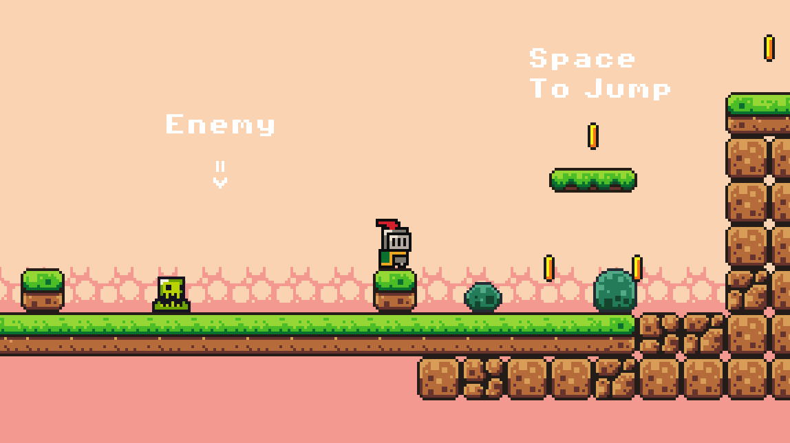
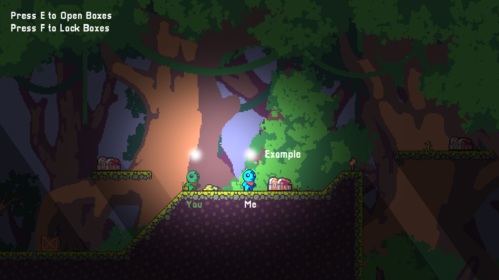

# Game Creation Tutorial Repository

This is a repository containing 2 different games to teach game development with [Godot](https://godotengine.org/) engine.

**Note**: Repository is still under development.

## Concepts in this repository

1. Basics of the engine. (**_ready**, **_process** and **_physics_process** functions)
2. Basics of making a 2D game.
   1. Using Tile layers
   2. Create Auto tiles
   3. Creating a moving background
   4. Using animated sprite to create our character
   5. Writing basic gdscript to control our character
   6. Physics in 2D
3. Signals and how to use them
4. Creating Scenes and reusing them
5. The main Cycle of the game
6. Creating UI
7. Basics of multiplayer in gdscript
8. Changing scenes
9. There is more... I just don't remember them all

### [First Game Demo](./2d_platformer)

### [Second Game Demo](./chest_choose/demo.png) (With multiplayer)

